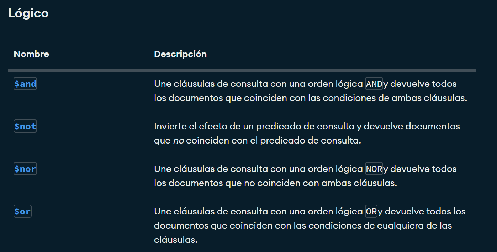

# Crud y consultas en MongoDB

## Crear una base de datos 
Solo se cra si contiene por lomenos una colección 
**use bd1**

## Como crear una colección 
use bd1
db.createCollection("Empleado)

## Mostrar colecciones de base de datos 
show collections

## Insertar un documento 
```json
db.alumnos.insertOne(
{
  nombre:'Soyla',
  apellido1:'Vaca',
  edad: 32,
  ciudad:'San miguel de las piedras' 
  }
)
```


# Insercion de un documento mas complejo con array
```json
db.alumnos.insertOne(
{
  nombre:"Joaquin",
  apellido1:"Dorian",
  apellido2:"Guerrero",
  edad:15,
  aficiones: ['Cerveza','Hueva','Canabis']
}
)
```


## Insercion de documentos mas complejos con documentos anidados y ID
```json
 db.alumnos.insertOne(
{
   nombre:'Jose Luis',
   apellido1:"Herrera",
   apellido2:"Gallardo",
   edad: 41,
   estudios:[
               'Ing en sistemas computacionales',
               'Maestria en tecnologias de informacion'
            ],
   experiencia: {
                  lenguaje: 'SQL',
                  sbd: "SQL Server",
                   aniosExp: 14
                 }
}
)

db.alumnos.insertOne(
{
    _id:3,
    nombre:'Sergio',
    apellido: 'Ramos',
    equipo: 'Monterrey',
    aficiones: [ 'Dinero', 'Hombres', 'Fiesta],
    talentos: {
        futbol: true,
        bañarse: false
    }
}
)
```

## Insertar multiples documentos 
```json
db.alumnos.insertMany(
[
  {
    _id: 12,
    nombre: 'Roberto',
    apellido: 'Gomez',
    edad: "23",
    descripcion: "Es un comediante bueno",
  },
  {
    nombre: "Luis",
    apellido: "Suarez",
    edad: 43,
    habilidades: [
                   'Correr', 'dormir', 'Morder'
                 ],
    direcciones:{
                  calle: 'Del infierno',
                  numero: 666
                },
    esposas:[
    {
        nombre: "Marisol",
        edad: 20,
        pension: 350,
        hijos: [ 'Joaquin', 'Bridget']
    },
    {
        nombre: "Dorien",
        edad: 46,
        pension: 6500.56,
        complaciente: true
    }
]
}
]
)

```

  # Practica 1
   ## Cargar datos
   [Libros]
   [Libros.json](./data/empleados.json)

   ## Busquedas. Condiciones simples de igualdad. Metodo find()


   1. Seleccionar todos los documentos de la coleccion libros
   ```json
   db.libros.find({})
   ```

   2. Mostrar todos los documentos que sean de la editorial biblio

   ``json
   db.libros.find({editorial:'Biblio'})
   ```

   3. Mostrar todos los documentos donde el precio sea 25
   ``json 
      db.libros.find({precio:25})
   ```

   4. Seleccionar todos los documentos donde el titulo sea json para todos
   ``json
   db.libros.find({titulo:'JSON para todos'})
   ```

## Operadores de comparacion

[Operadores de comparacion](https://www.mongodb.com/docs/manual/reference/operator/query/)


1. Mostrar todos los documentos mayores a 25
```json
db.libros.find({precio:{$gte:25}})
```

2. Mostrar todos los documentos donde el precio sea 25
```json
db.libros.find({precio:{$eq:25}})
```

3. Mostrar todos los documentos cuya cantidad sea menor a 5
```json
db.libros.find({cantidad:{$lt:5}})

4. Mostrar los documentos que pertenezcan a la editorial biblio o Planeta
```json
db.libros.find({editorial:{$in:['Biblio','Planeta']}})
```

5. Mostrar todos los documentos de libors que cuesten 20 o 25
```json
db.libros.find({precio:{$in:[20, 25]}})
```

6. Mostrar todos los documentos de libros que no cuesten 20 o 25
```json
db.libros.find({precio:{$nin :[20,25]}})
```

7. Mostrar el primer documento de libros que cuesten 20 o 25
```json
db.libros.findOne({precio:{$in :[20,25]}})

```

## Operadoes Logicos
[Operadores logicos](https://www.mongodb.com/docs/manual/reference/operator/query/)



### Operador AND

1. La simple, mediante condiciones separadas por comas

**Sintaxis**
```json
db.coleccion.find({condicion1, condicion2}) ->Con esto asume que es una **AND**
```

2. Usando el operador $and

**Sintaxis**
```json
db.coleccion.find({$and:[{condicion1},{coondicion2}]})
```

### Ejercicios
1. Mostrar todos aquellos libros que cuesten mas de 25 y cuya cantidad sea inferior a 15
```json
db.libros.find({precio:{$gt:25},cantidad:{$lt:15}})
```

2. Mostrar todos aquellos libros que cuesten mas de 25 y cuya cantidad sea inferior a 15 y _id igual a 4
**FORMA SIMPLE**
```json
db.libros.find({precio:{$gt:25},cantidad:{$lt:15}, _id:{$eq:4}})
```

```json
db.libros.find({precio:{$gt:25},cantidad:{$lt:15}, _id:4})
```

**Operador $AND**
1. Mostrar todos aquellos libros que cuesten mas de 25 y cuya cantidad sea inferior a 15
```json
db.libros.find(
 {
  $and:[
  {precio:{$gt:25}},
  {cantidad:{$lt:15}} 
  ]
 }
)
```

2. Mostrar todos aquellos libros que cuesten mas de 25 y cuya cantidad sea inferior a 15 y _id igual a 4
```json
db.libros.find(
{
  
})
```
### Operador OR 

#### Mosrtar todos aquellos lirbos que cuesten mas de 25 o cuya cantidad sea inferior a 15

json
db.libros.find(
    {
        $or:[
            {precio:{$gt:25}},
            {cantidad:{$lt:15}}
        ]
    }
)


### AND y OR combinadas

1. Mostrar los libros de la editorial biblio, con un precio mayor a 40 o libros de la Editorial planeta con un precio mayor a 30

 json
db.libros.find(
{
    $or:[
        {$and:[{editorial:"Biblio"}, {precio:{$gt:30}}]},
        {$and:[{editorial:{$eq:"Planeta"}}, {precio:{$gt:20}}]}
    ]
})

**forma simple**

 json
db.libros.find(
{
    $or:[
        {editorial:"Biblio", precio:{$gt:30}},
        {editorial:{$eq:"Planeta"}, precio:{$gt:20}}
    ]
}
)


## Proyeccion de Columnas

**Sintaxis**
 JSON
db.coleccion.find(filtro, columnas)

db.libros.find({}, {titulo:1})


1. Seleccionar todos loa documentos mostrando el titulo y la editorial

 json
db.libros.find({}, {titulo:1, editorial:2})

sin ID
db.libros.find({}, {titulo:1, editorial:2, _id:0})
 

2. Seleccionar todos los documentos de la editorial planeta mostrando solamente el titulo y la editorial
 ```json
db.libros.find(
{editorial:"Planeta"}, 
{titulo:1, editorial:1, _id:0}
)

```
## Operador exists(permite saber si u campo se encuentra o no en un documento)

```json
 db.libros.find(
... {editorial:{$exists:true}})


 db.libros.insertOne(
 {
  _id:10,
  titulo: 'Mongo en entornos graficos',
  editorial: 'Terra',
  precio:125
 }
 )
```
1. Mostrar todos los documentos que no contengan el campo cantidad

```json
db.libros.find(
{
  cantidad:{$exists:false}
}
)

```
## Operador type (Periite preguntar si un determinado campo corresponde con un tipo)


[Operador type(https://www.mongodb.com/docs/manual/reference/operator/query/type/#mongodb-query-op.-type)]

1. Mostrar todos los documentos donde el precio sea doble
```json
db.libros.find(
{
  precio:{$type:1}
}
)
db.libros.find(
{
  precio:{$type:16}
}
)
```
```json

 db.libros.insertOne(
 {
  _id:11,
  titulo: 'IA',
  editorial: 'Terra',
  precio:125.4,
  cantidad:20
 }
 )
```
```json
db.libros.find(
{
  precio:{$type:1}
},
{
  _id:0,
  cantidad:0
}
)


db.libros.insertMany([
 {
    _id: 12,
    titulo: 'IA',
    editorial: 'Terra',
    precio: 125, 
	cantidad: 20
  },
  {
    _id: 13,
    titulo: 'Python para todos',
    editorial: 2001,
    precio: 200, 
	cantidad: 30
  }]
  )

  db.libros.find(
{
  editorial:{$type:2}
}
)


db.libros.find(
{
  _id:13}

)
```
1. Seleccionar los documentos donde la editorial sea de tipo entero
```json
  db.libros.find(
{
  editorial:{$type:16}
}
)
```
2. Seleccionar todos los documentos donde la editorial sea string

```json
  db.libros.find(
{
  editorial:{$type:2}
}
)

  db.libros.find(
{
  editorial:{$type:'string'}
}
)
```


## Practica de consultas 

1. Instalar las tools de mongodb
[DatabaseTools(https://www.mongodb.com/try/download/database-tools)]

2. Cargar el json empleados (Debemos estar ubicados en la carpeta donde se encuentra el JSON empleados)


-En local:
comando: 
 mongoimport --db curso --collection empleados --file empleados.json


# Modificando documentos
## Comandos importantes

1. updateOne -> Modificar un solo documento.
2. updateMany -> Modificar multiples documentos.
3. replaceOne -> Sustituir el contenido completo de un documento.

 Tiene el siguiente formato:
```json 

  db.collection.updateOne(
  {filtro},
  {operador: }
  )
```
[Operadores Update](https://www.mongodb.com/docs/manual/reference/operator/update/)

### Operador set

1. Modificar un documento
```json
 db.libros.updateOne(
 {titulo:'Python para todos'}, {$set:{titulo:'Java para todos'}}
 ) 
```

Actualizar el precio a 100 y la cantidad a 50 para el id 10
```json
  db.libros.updateOne(
  {_id:10},{$set:{precio:100, cantidad:50}})
```

### Modificar multiples documentos

--Modificar todos los documentos donde el precio sea mayor a 100 a un precio de 150

```json
db.libros.updateMany(
{precio:{$gt:100}},
{$set:{precio:150}}
)
```

2. Operador $inc y $mul

- Actualiza con un incremento de 5 todos los documentos
```json
db.libros.updateMany(
{},
{$inc:{precio:5}}
)

db.libros.updateOne({_id:2},{$set:{precio:56, existencia:10}})
```
-Actualizar con multiplicacion de 2 todos los documentos que la cantidad sean mayores a 20
```json
db.libros.updateMany({cantidad:{$gt:20}},{$mul:{cantidad:2}})
```
- Actualizar todos los documentos donde el precio sea mayor a 20 y se multiplique por 2 la cantiddad y el precio
```json
db.libros.updateMany({precio:{$gt:20}},{$mul:{cantidad:2, precio:2}})
```

3. reemplazar documentos (replaceOne)
```json
db.libros.replaceOne({_id:2},{titulo:'De la tierra a la luna', autor:'Julio Verne', precio:500})
```

# Borrar documentos

1. deleteOne -> Elimina un solo documento
2. deleteMany -> Elimina multiples documentos


1. Eliminar el documento con id 2
```json
db.libros.deleteOne({_id:2})
```
2. Eliminar los documentos donde  la cantidad sea mayor o igual a 150
```json
db.libros.deleteMany({cantidad:{$gte:150}})
```

# Expresiones regulares 

1. Buscar los libros que contenga el titulo la letra t
```json
db.libros.find({titulo:/t/})
```
2. Buscar los libros que en el titulo contengan la palabra json
```json
db.libros.find({titulo:/json/})
```
3. Buscar todos los documentos que en el titulo terminen en todos
```json
db.libros.find({titulo:/tos$/})
``` 
4. Todos los documentos que en el titulo coomiencen con J
```json
db.libros.find({titulo:/^J/})
```

# Operador $regex
[Operador Regex]()

-- Seleccionar los libros que contengan la palabra para en titulo
```json
db.libros.find({titulo: {$regex:'para'}})

db.libros.find({titulo: {$regex:'JSON'}})

db.libros.find({titulo: {$regex:/JSON/}})

```

-Distinguir entre mayusculas y minusculas
```json
db.libros.find({titulo: {$regex:/json/}}) ->No distingue entre mayusculas y minusculas

db.libros.find({titulo: {$regex:/json/, $options:'i'}})
db.libros.find({titulo: {$regex:/json/i}}
```


--Seleccionar todos los libros que comiencen con J o j
```json
db.libros.find({titulo: {$regex:'^j','i'}})

--Seleccionar todos los libros que termien en es
db.libros.find({titulo: {$regex:/es$/i}})

```

# Metodo sort (Ordenar documentos)

1. Ordenar los libros de manera ascendente por el precio
```json
db.libros.find({},{titulo:1, precio:1, _id:0}).sort({precio:1})
```
2. Ordenar los libros de manera descendente por el precio 
```json
 db.libros.find({},{titulo:1, precio:1, _id:0}).sort({precio:-1})
 ```
3. Ordenar los libros de manera ascendente por la editorial y de manera descendente por el precio, mostranto el titulo, el precio y la editorial
```json
db.libros.find({},{titulo:1, precio:1, editorial:1, _id:0}).sort({editorial:1, precio:-1})
```


# Otros metodos skip, limit, size
```json
db.libros.find({},{titulo:1, precio:1, _id:0, editorial:1}).size()

db.libros.find({titulo:{$regex:/Java/i}}).size()
```

--Buscar todos los libros pero mostrando los dos primeros
```json
db.libros.find({},{titulo:1, editorial:1, precio:1, _id:0}).limit(2)

--Mostrar los 3 ultimos libros 
  db.libros.find({},{titulo:1, editorial:1, precio:1, _id:0}).sort({precio:-1}).limit(3)

db.libros.find({}, {titulo:1, editorial:1, precio:1}).skip(2)

--Seleccionar todos los libros ordenados por titulo de forma descendente saltanto los dos primeros y que muestre cuantos son

 db.libros.find({}).sort({titulo:-1}).skip(2).size()
```


# Borrar colecciones y base de datos

```json
use db5

db.createCollection('ejemplo')

show collections

db.ejemplo.insertOne({
  nombre:'Chapuin'
 }
)

db.ejemplo.drop
db.dropDatabase()
```